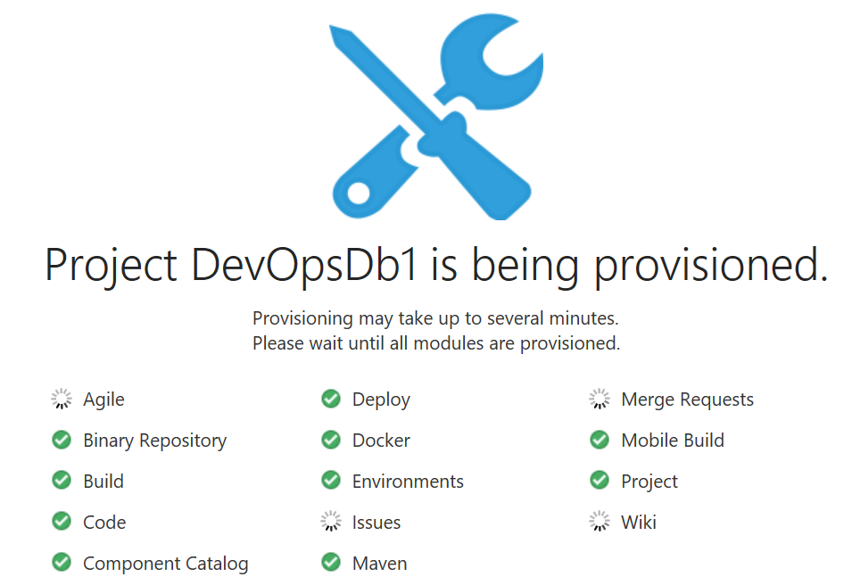

# Create a Database Instance on OCI with terraform

## Create your env in Developer Cloud Service

On the Oracle Cloud Web Console, go on the dashboard and then in Developer Cloud Service. You have to create an Instance (ex : DevOpsDb). 

In order to speed up your work, if you are with Oracle people, we created it for you so you just click on the right menu "Access Service instance".

Now create an Empty Private Project called "DevOpsDbx". Update the number in the name according to your user number (ex : DevOpsDb1 if you are user1.devops). It takes 2 minute to get  it.



## Create your git repository in Developer Cloud Service

Now Create the first empty git repository called "devopsdb". Note that later you will create another one called "quizdb".


Copy the url, you will need it.

## Push your code to your  git repository in Developer Cloud Service

In the DevOpsDbVM (use Putty), go in the devops directory (your local project). We got this code before and you updated it before. 

```shell
cd devopsdb
#update the git origin
git remote show origin
git remote set-url origin "url of your devops git repository"
git remote show origin (enter your cloud password when asked)
#ignore the state file (you will not push it)
>> .gitignore
use vi to put the directory of the terraform state in .gitignore (/home/opc/devopsdb/.terraform/)
#commit your code
git status (you see the update you did before on the code)
git add .
git commit -m "YOURNAME first commit"
#push your code to DevCs reposiroty
git push origin master (enter your cloud password)
```

In DevCs on the Cloud Web Console you can now see your last activities to check that all is ok.

## Create your build VM in  Developer Cloud Service

The build VM is the VM that will execute all the jobs that you will do later.

On DevCs click on your upper right icon then click on Organization.

Click on VM Template. Create a New Template "TerraformTemplate" and add the software package below


Click On Configure Compute Account in order to give information to DevCS (it will need it to create the VM).

Click on Virtual Machines. Create one new Virtual Machine that uses your Template.


Now you can return to your DevCS project (ex DevOpsDb1)

## Create the terraform job in  Developer Cloud Service

In DevCS click on Build then on "New Job". The name of the job is Db_Instance_Creation. You use the TerraformTemplate created before (it means the job will run in a Virtual Machine that will have all the products of the TerraformTemplate).


Then You add a git source control (it is your devops.git)


And you add a Unix Shell Builder like below


Now for the first test you comment all the lines after 4 in the Unix Shell Builder (use # on each line) and you save your job.

## Run the terraform job in  Developer Cloud Service

Click on "Build Now" on the job "Db_Instance_Creation".

Note that it will take time to start because the first time the Build Virtual Machine is not started so it takes time to start.

When finished look at the build Log.

Now in the Job "Db_Instance_Creation", you delete the comments # after the line 4.

You run the job again. It will take at least 1h to create the database so you have time to create the next jobs of this workshop. At the end of the first job you will have the IP Address of the new Database.

So now if the first job that creates the Database is finished you can run this second job and see the result.

Note that if the first job is not finished continue this workshop and create the Job number 3. You will come back later to run this job.

Next  [04-devcs-patch.md](04-devcs-patch.md)