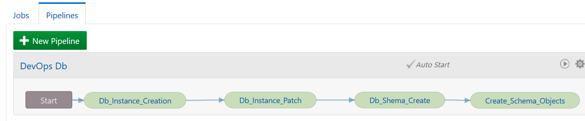

# Create the pipeline in Developer Cloud Service

In the Oracle Cloud Web Console click on Build Menu then click on Pipeline.

Create a new pipeline "DevopsDb" like below :

 Then on the right click for building the pipeline. Then you will see all the jobs running from start to end. Nothing new will happen sure because the database is already there :o).

Next [07-sqldev.md](07-sqldev.md)